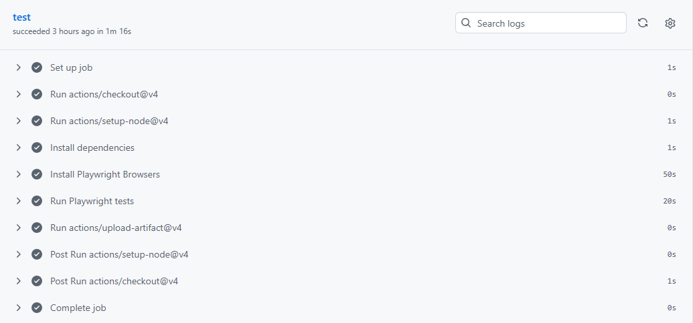
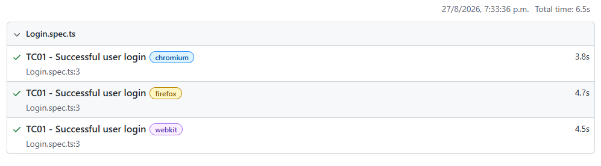

# 🎭 Playwright Login Testing

A hands-on QA automation practice focused on validating a successful user login flow using **Playwright** and **TypeScript**.

This project was developed following a Playwright tutorial, with additional practice focused on understanding test structure, locators, assertions, and cross-browser execution.

## 🧪 Test Scenario

The automated test validates the following login flow:

1. Open the Practice Software Testing application.
2. Verify the page title.
3. Navigate to the Sign in page.
4. Enter valid user credentials.
5. Submit the login form.
6. Verify that the user is redirected to the **My Account** page.

## 🛠️ Tech Stack

* **Playwright**
* **TypeScript**
* **Node.js**
* **HTML Reporter**

## 🌐 Cross-Browser Testing

The test is configured to run against:

* Chromium
* Firefox
* WebKit

### Test Result

**3/3 tests passed successfully.** ✅

GitHub Actions

Playwright HTML Report

## 🎯 What This Practice Demonstrates

* UI test automation with Playwright
* Locator strategies using `data-test` attributes
* Page title and content assertions
* Successful login flow validation
* Cross-browser test execution
* HTML test reporting
